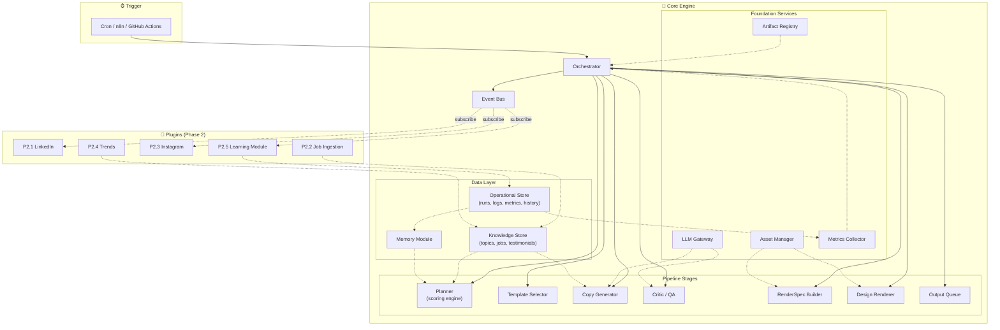

# JobInGen AI Content Creation Engine — System Architecture v3 (Final)

> **Changelog from v2**: Split stores (Knowledge vs Operational), LLM Gateway, RenderSpec Builder as own module, Event Bus, observability metrics, Artifact Registry (version everything), Planner scoring engine, Template Selector module.

---

## 1. Problem Summary

Build a fully automated AI content engine that produces daily, on-brand social media posts (copy + designed images) for JobInGen. One command → complete content pack. Zero manual work. Phase 2 integrations are optional plugins — the core engine works end-to-end with all externals off.

---

## 2. Architectural Principles

| # | Principle | How |
|---|-----------|-----|
| 1 | **Typed contracts** | Every module communicates via Pydantic models. No free-form text between modules. |
| 2 | **Single state object** | `ContentState` flows through the pipeline. Every module reads and writes to it. |
| 3 | **Centralized orchestration** | Orchestrator is the only entity that invokes modules. Modules never call each other. |
| 4 | **Deterministic rendering** | Renderer receives a typed `RenderSpec` — never raw LLM output. |
| 5 | **Version everything** | Artifact Registry versions prompts, rubrics, schemas, and HTML templates as code. |
| 6 | **Separated concerns** | Knowledge data (topics, jobs) and operational data (runs, logs, metrics) live in separate stores. |
| 7 | **Provider-agnostic LLM** | A dedicated LLM Gateway handles retries, caching, fallback, cost tracking, rate limiting. Consumers never know about providers. |
| 8 | **Event-driven extensibility** | An internal Event Bus lets plugins subscribe to pipeline events without modifying the Orchestrator. |
| 9 | **Observable by default** | Every run emits structured metrics (latency, cost, scores, retries) ready for dashboards. |

---

## 3. High-Level Architecture



### Orchestrator as Central Controller

```
                        Orchestrator
                             │
              ┌──────────────┼──────────────────┐
              │              │                  │
     Artifact Registry   LLM Gateway     Event Bus
              │              │                  │
    ┌─────────┼─────────┐    │                  │
    │         │         │    │                  │
Knowledge  Operational Memory               Metrics
  Store      Store                          Collector
                             │
              ┌──────────────┼──────────────┐
              │              │              │
          Planner     Asset Manager     (ready)
              │
              ▼
      Template Selector
              │
              ▼
        Copy Generator ←──── LLM Gateway
              │
              ▼
         Critic / QA   ←──── LLM Gateway
           ↙       ↘
     Retry (<3)    Pass
                     │
                     ▼
            RenderSpec Builder
                     │
                     ▼
             Design Renderer
                     │
                     ▼
              Output Queue
                     │
                Event Bus → (PlanCreated, CopyGenerated, QAPassed, Rendered, Delivered)
```

