# JobInGen AI Content Creation Engine — System Architecture v3 (Final)

> **Changelog from v2**: Split stores (Knowledge vs Operational), LLM Gateway, RenderSpec Builder as own module, Event Bus, observability metrics, Artifact Registry (version everything), Planner scoring engine, Template Selector module.

---

## 1. Problem Summary

Build a fully automated AI content engine that produces daily, on-brand social media posts (copy + designed images) for JobInGen. One command → complete content pack. Zero manual work. Phase 2 integrations are optional plugins — the core engine works end-to-end with all externals off.

---

## 2. Architectural Principles

| # | Principle | How |
|---|-----------|-----|
| 1 | **Typed contracts** | Every module communicates via Pydantic models. No free-form text between modules. |
| 2 | **Single state object** | `ContentState` flows through the pipeline. Every module reads and writes to it. |
| 3 | **Centralized orchestration** | Orchestrator is the only entity that invokes modules. Modules never call each other. |
| 4 | **Deterministic rendering** | Renderer receives a typed `RenderSpec` — never raw LLM output. |
| 5 | **Version everything** | Artifact Registry versions prompts, rubrics, schemas, and HTML templates as code. |
| 6 | **Separated concerns** | Knowledge data (topics, jobs) and operational data (runs, logs, metrics) live in separate stores. |
| 7 | **Provider-agnostic LLM** | A dedicated LLM Gateway handles retries, caching, fallback, cost tracking, rate limiting. Consumers never know about providers. |
| 8 | **Event-driven extensibility** | An internal Event Bus lets plugins subscribe to pipeline events without modifying the Orchestrator. |
| 9 | **Observable by default** | Every run emits structured metrics (latency, cost, scores, retries) ready for dashboards. |

---

## 3. High-Level Architecture

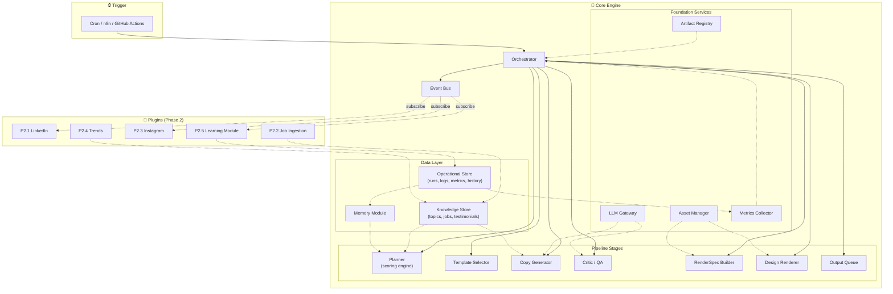

### Orchestrator as Central Controller

```
                        Orchestrator
                             │
              ┌──────────────┼──────────────────┐
              │              │                  │
     Artifact Registry   LLM Gateway     Event Bus
              │              │                  │
    ┌─────────┼─────────┐    │                  │
    │         │         │    │                  │
Knowledge  Operational Memory               Metrics
  Store      Store                          Collector
                             │
              ┌──────────────┼──────────────┐
              │              │              │
          Planner     Asset Manager     (ready)
              │
              ▼
      Template Selector
              │
              ▼
        Copy Generator ←──── LLM Gateway
              │
              ▼
         Critic / QA   ←──── LLM Gateway
           ↙       ↘
     Retry (<3)    Pass
                     │
                     ▼
            RenderSpec Builder
                     │
                     ▼
             Design Renderer
                     │
                     ▼
              Output Queue
                     │
                Event Bus → (PlanCreated, CopyGenerated, QAPassed, Rendered, Delivered)
```

---

## 4. The ContentState Object

Every module reads what it needs and writes its output back. The Orchestrator manages transitions.

```python
# src/models/content_state.py
from pydantic import BaseModel, Field
from typing import Optional
from datetime import date, datetime
from enum import Enum
from uuid import uuid4

class PipelineStatus(str, Enum):
    INITIALIZED  = "initialized"
    PLANNED      = "planned"
    TEMPLATE_SET = "template_set"
    DRAFTED      = "drafted"
    QA_PASSED    = "qa_passed"
    QA_FAILED    = "qa_failed"
    RENDER_SPEC  = "render_spec_built"
    RENDERED     = "rendered"
    DELIVERED    = "delivered"
    FAILED       = "failed"

# ── Module Contracts ──

class ContentPlan(BaseModel):
    pillar: str
    topic: str
    topic_id: str
    audience: str
    suggested_cta: str
    assets_needed: list[str]
    dimensions: str                        # "1080x1080"
    scoring: TopicScore                    # Full scoring breakdown

class TopicScore(BaseModel):
    """Output of the Planner scoring engine."""
    total: float
    pillar_deficit: float
    seasonality: float
    engagement_history: float
    freshness: float
    trending: float
    campaign_priority: float

class TemplateSelection(BaseModel):
    template_type: str                     # "carousel"
    slide_count: int
    prompt_key: str                        # "copywriter_carousel_v2"
    layout_hints: dict                     # Template-specific guidance

class SlideContent(BaseModel):
    slide_num: int
    heading: str
    body: str
    visual_note: str

class CopyOutput(BaseModel):
    hook: str
    slides: list[SlideContent]
    caption: str
    hashtags: list[str]
    cta: str
    alt_text: str

class QAReport(BaseModel):
    overall_score: float
    passed: bool
    attempt: int
    scores: dict[str, float]
    feedback: str
    rubric_version: str

class SlideRenderData(BaseModel):
    slide_num: int
    heading: str
    body: str
    layout: str
    accent_color: Optional[str] = None
    icon: Optional[str] = None

class RenderSpec(BaseModel):
    """Deterministic input to the Renderer."""
    template: str
    template_version: str                  # "carousel_v6"
    dimensions: dict
    brand_colors: dict
    font_family: str
    logo_path: str
    assets: dict[str, str]
    slides: list[SlideRenderData]

class LLMCallLog(BaseModel):
    module: str
    model: str
    input_tokens: int
    output_tokens: int
    cost_usd: float
    latency_ms: int
    cached: bool = False

# ── The State Object ──

class ContentState(BaseModel):
    run_id: str = Field(default_factory=lambda: str(uuid4())[:8])
    date: date
    status: PipelineStatus = PipelineStatus.INITIALIZED
    started_at: datetime = Field(default_factory=datetime.utcnow)

    # Step 1: Planner
    plan: Optional[ContentPlan] = None

    # Step 2: Template Selector
    template: Optional[TemplateSelection] = None

    # Step 3: Generator
    copy: Optional[CopyOutput] = None

    # Step 4: Critic
    qa: Optional[QAReport] = None
    qa_attempts: int = 0

    # Step 5: RenderSpec Builder
    render_spec: Optional[RenderSpec] = None

    # Step 6: Renderer
    image_paths: list[str] = Field(default_factory=list)

    # Step 7: Queue
    output_dir: Optional[str] = None
    pack_manifest_path: Optional[str] = None

    # Observability
    llm_calls: list[LLMCallLog] = Field(default_factory=list)
    errors: list[str] = Field(default_factory=list)
    total_duration_ms: Optional[int] = None

    # Artifact versions used (for reproducibility)
    artifact_versions: dict[str, str] = Field(default_factory=dict)
    # e.g. {"planner_prompt": "v4", "critic_prompt": "v3",
    #        "rubric": "v2", "carousel_template": "v6"}
```

---

## 5. Module-by-Module Design

---

### 5.1 · Artifact Registry (Foundation)

> Replaces "Prompt Registry". Versions **everything**: prompts, rubrics, schemas, and HTML templates.

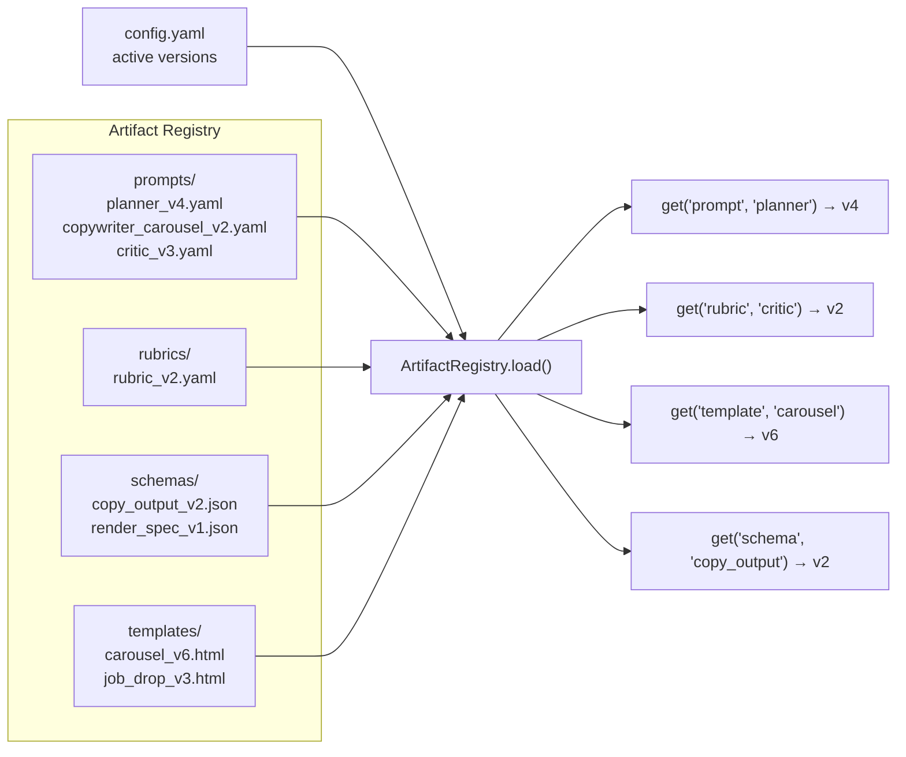

**Directory layout**:
```
registry/
├── prompts/
│   ├── planner_v1.yaml
│   ├── planner_v2.yaml
│   ├── planner_v3.yaml
│   ├── planner_v4.yaml              ← active
│   ├── copywriter_carousel_v1.yaml
│   ├── copywriter_carousel_v2.yaml  ← active for carousel
│   ├── copywriter_jobdrop_v1.yaml   ← active for job_drop
│   ├── copywriter_meme_v1.yaml      ← active for meme
│   ├── copywriter_comparison_v1.yaml
│   ├── copywriter_success_v1.yaml
│   ├── copywriter_mentor_v1.yaml
│   ├── copywriter_insight_v1.yaml
│   ├── critic_v1.yaml
│   ├── critic_v2.yaml
│   └── critic_v3.yaml               ← active
├── rubrics/
│   ├── rubric_v1.yaml
│   └── rubric_v2.yaml               ← active
├── schemas/
│   ├── copy_output_v1.json
│   ├── copy_output_v2.json          ← active
│   └── render_spec_v1.json          ← active
├── templates/
│   ├── base.css
│   ├── carousel_v1.html ... carousel_v6.html  ← active
│   ├── insight_card_v1.html ... insight_card_v3.html
│   ├── job_drop_v1.html ... job_drop_v3.html
│   ├── comparison_v1.html ... comparison_v2.html
│   ├── success_story_v1.html
│   ├── mentor_spotlight_v1.html
│   └── meme_v1.html ... meme_v2.html
└── _manifest.yaml                    # Maps active versions
```

**Config selects active versions**:
```yaml
# config.yaml → registry section
registry:
  dir: "registry"
  active:
    prompts:
      planner: "v4"
      copywriter_carousel: "v2"
      copywriter_jobdrop: "v1"
      copywriter_meme: "v1"
      copywriter_comparison: "v1"
      copywriter_success: "v1"
      copywriter_mentor: "v1"
      copywriter_insight: "v1"
      critic: "v3"
    rubrics:
      critic: "v2"
    schemas:
      copy_output: "v2"
      render_spec: "v1"
    templates:
      carousel: "v6"
      insight_card: "v3"
      job_drop: "v3"
      comparison: "v2"
      success_story: "v1"
      mentor_spotlight: "v1"
      meme: "v2"
```

**Interface**:
```python
class ArtifactRegistry:
    def get(self, category: str, name: str) -> ArtifactConfig:
        """Load the active version of any artifact type."""
        version = self.active[category][name]
        path = f"{self.dir}/{category}/{name}_{version}.yaml"
        return ArtifactConfig.from_file(path)

    def get_template_html(self, template_type: str) -> str:
        """Load the active HTML template file."""
        ...

    def list_versions(self, category: str, name: str) -> list[str]: ...
    def diff(self, category: str, name: str, v1: str, v2: str) -> str: ...
    def snapshot(self) -> dict[str, str]:
        """Return all active versions for reproducibility logging."""
        # {"planner_prompt": "v4", "critic_rubric": "v2", "carousel_template": "v6"}
```

---

### 5.2 · LLM Gateway (Foundation)

> Dedicated abstraction layer. Neither Generator nor Critic know about providers, retries, or costs.

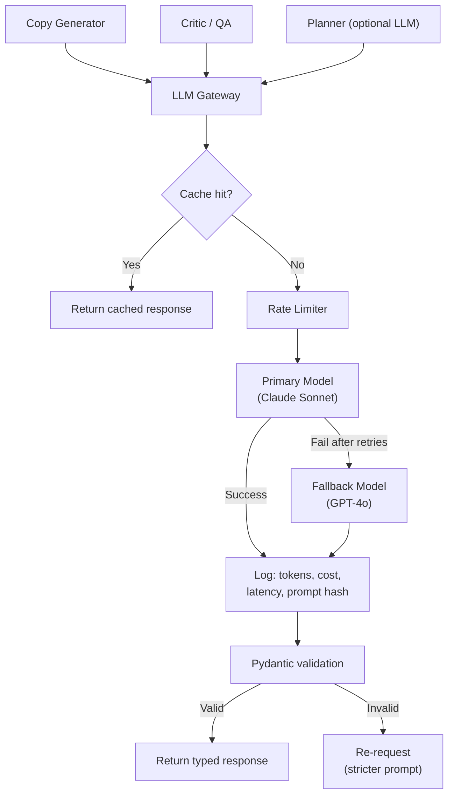

**Responsibilities**:

| Responsibility | Detail |
|---------------|--------|
| **Provider abstraction** | `litellm` under the hood. Consumers call `gateway.complete(prompt, output_model)` |
| **Retries** | 3 retries with exponential backoff (1s → 2s → 4s) on transient errors |
| **Fallback** | Primary fails → try fallback model. Configurable chain |
| **Caching** | Hash prompt → if seen within TTL, return cached. Saves cost on retries/re-runs |
| **Rate limiting** | Token bucket per provider. Prevents 429s |
| **Cost tracking** | Every call logs model, input/output tokens, USD cost → returns `LLMCallLog` |
| **Prompt logging** | Full prompt text logged at DEBUG level for debugging |
| **Structured output** | Parses response into Pydantic model. Invalid → auto-retry with error context |

**Interface**:
```python
class LLMGateway:
    async def complete(
        self,
        system_prompt: str,
        user_prompt: str,
        output_model: type[BaseModel],     # Pydantic model for structured output
        temperature: float = 0.7,
        max_tokens: int = 2000,
        cache_key: Optional[str] = None,
    ) -> tuple[BaseModel, LLMCallLog]:
        """Single entry point for all LLM calls. Returns typed output + call metadata."""
        ...
```

**Config**:
```yaml
llm:
  primary:
    provider: "anthropic"
    model: "claude-sonnet-4-20250514"
  fallback:
    provider: "openai"
    model: "gpt-4o"
  temperatures:
    generate: 0.7
    retry: 0.3
    critic: 0.2
    planner: 0.4
  max_tokens:
    single: 2000
    carousel: 4000
  timeout_seconds: 60
  max_retries: 3
  cache:
    enabled: true
    ttl_seconds: 3600
  rate_limit:
    anthropic: { rpm: 50, tpm: 100000 }
    openai: { rpm: 60, tpm: 150000 }
```

---

### 5.3 · Knowledge Store (Data)

> Static/semi-static content that evolves slowly. Manually curated.

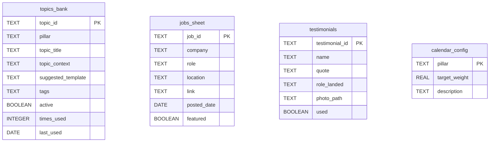

**SQLite file**: `data/knowledge.db`

**Seeded from**: `seed_data/*.json` on first run or `python main.py --seed`

**Update cadence**: Weekly/monthly — add new topics, update job listings, add testimonials.

---

### 5.4 · Operational Store (Data)

> Runtime data that grows daily. Machine-generated.

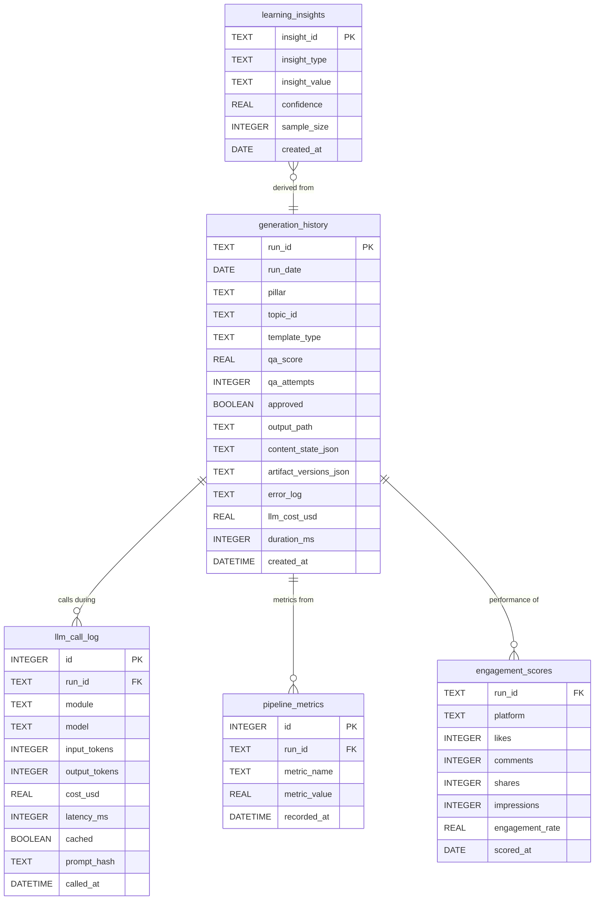

**SQLite file**: `data/operational.db`

**Why separate?**

| Aspect | Knowledge Store | Operational Store |
|--------|----------------|-------------------|
| Update cadence | Weekly/monthly | Every run |
| Author | Human (curated) | Machine (automated) |
| Backup strategy | Version in git | Rolling snapshots |
| Size growth | Slow (hundreds of rows) | Fast (thousands of rows/year) |
| Reset safely? | No (loses curated data) | Yes (can regenerate) |

---

### 5.5 · Memory Module (Intelligence)

**Purpose**: Queries the Operational Store to provide the Planner with history awareness. Prevents repetition and enables learning.

```python
class Memory:
    def __init__(self, ops_store: OperationalStore):
        self.db = ops_store

    def get_recent_topics(self, days: int = 14) -> list[dict]:
        """Topics used in the last N days.""" ...

    def get_pillar_distribution(self, days: int = 14) -> dict[str, float]:
        """Actual vs target pillar ratios.""" ...

    def is_topic_on_cooldown(self, topic_id: str, cooldown_days: int = 30) -> bool:
        """Was this topic used recently?""" ...

    def get_format_performance(self) -> dict[str, float]:
        """Average engagement by template type (for scoring engine).""" ...

    def get_day_of_week_performance(self) -> dict[str, dict[str, float]]:
        """Best pillar/template combos per day of week.""" ...

    def log_run(self, state: ContentState) -> None:
        """Record a completed run.""" ...
```

---

### 5.6 · Content Planner — Scoring Engine (Intelligence)

> Evolves from hard-coded rules to `argmax(score(topic))`.

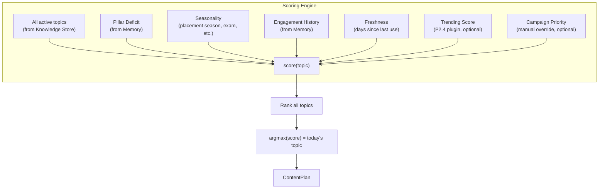

**Scoring formula**:
```python
def score(self, topic: Topic, context: PlannerContext) -> TopicScore:
    weights = self.config.planner.score_weights

    pillar_deficit = self._calc_pillar_deficit(topic.pillar, context.pillar_distribution)
    seasonality = self._calc_seasonality(topic, context.date)
    engagement = self._calc_engagement_history(topic, context.format_performance)
    freshness = self._calc_freshness(topic, context.recent_topics)
    trending = self._calc_trending(topic, context.trend_data)       # 0.0 if plugin off
    campaign = self._calc_campaign(topic, context.active_campaigns)  # 0.0 if none

    total = (
        weights.pillar_deficit   * pillar_deficit   +  # default 0.30
        weights.seasonality      * seasonality      +  # default 0.10
        weights.engagement       * engagement       +  # default 0.15
        weights.freshness        * freshness        +  # default 0.25
        weights.trending         * trending         +  # default 0.10
        weights.campaign         * campaign            # default 0.10
    )

    return TopicScore(
        total=total,
        pillar_deficit=pillar_deficit,
        seasonality=seasonality,
        engagement_history=engagement,
        freshness=freshness,
        trending=trending,
        campaign_priority=campaign
    )
```

**Config**:
```yaml
planner:
  pillars:
    Educate: 0.40
    Opportunity: 0.25
    Proof: 0.15
    Brand: 0.10
    Culture: 0.10
  history_window_days: 14
  topic_cooldown_days: 30
  score_weights:
    pillar_deficit: 0.30
    seasonality: 0.10
    engagement: 0.15
    freshness: 0.25
    trending: 0.10
    campaign: 0.10
  seasonality_rules:
    - months: [7, 8, 9]                # Jul–Sep placement season
      boost_pillars: ["Opportunity", "Educate"]
      boost_factor: 1.5
    - months: [12, 1]                  # Year-end / New Year
      boost_pillars: ["Culture", "Brand"]
      boost_factor: 1.3
```

**Output**: `ContentPlan` with the full `TopicScore` breakdown attached for observability.

---

### 5.7 · Template Selector (Intelligence → LLM)

> New module. Sits between Planner and Generator. Maps the chosen topic + template type to the **correct template-specific prompt**.

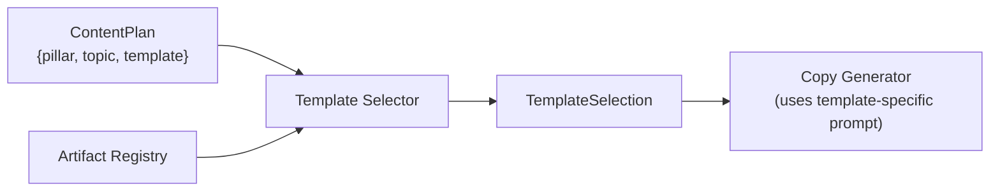

**Why this exists**: A carousel prompt is fundamentally different from a meme prompt or a job drop prompt. One generic "copywriter" prompt produces mediocre results for specialized formats.

**Template → Prompt mapping**:

| Template Type | Prompt File | Key Differences |
|--------------|-------------|----------------|
| Carousel | `copywriter_carousel_v2.yaml` | Slide-by-slide structure, progressive narrative, hook → value → CTA flow |
| Insight Card | `copywriter_insight_v1.yaml` | Single-panel impact, bold stat, minimal text |
| Job Drop | `copywriter_jobdrop_v1.yaml` | Company + role focus, requirements list, urgency CTA |
| Comparison | `copywriter_comparison_v1.yaml` | Two-column structure, do/don't framing |
| Success Story | `copywriter_success_v1.yaml` | Testimonial format, before/after narrative |
| Mentor Spotlight | `copywriter_mentor_v1.yaml` | Q&A style, credibility markers, personal advice |
| Meme | `copywriter_meme_v1.yaml` | Humor-first, relatable pain point, minimal text |

**Output — `TemplateSelection`**:
```json
{
  "template_type": "carousel",
  "slide_count": 5,
  "prompt_key": "copywriter_carousel_v2",
  "layout_hints": {
    "slide_1": "hook — bold statement with emoji",
    "slide_2_to_n": "value delivery — one concept per slide",
    "last_slide": "CTA card with logo and action"
  }
}
```

**Interface**:
```python
class TemplateSelector:
    def __init__(self, registry: ArtifactRegistry, config: Config):
        self.registry = registry
        self.compatibility = config.planner.template_compatibility

    def select(self, plan: ContentPlan) -> TemplateSelection:
        # 1. Get compatible templates for this pillar
        compatible = self.compatibility[plan.pillar]

        # 2. Pick best template (or use plan.suggested_template if valid)
        template_type = self._pick_template(plan, compatible)

        # 3. Resolve the template-specific prompt from registry
        prompt_key = f"copywriter_{template_type}"

        # 4. Get layout hints for this template type
        layout_hints = self._get_layout_hints(template_type)

        return TemplateSelection(
            template_type=template_type,
            slide_count=self._default_slides(template_type),
            prompt_key=prompt_key,
            layout_hints=layout_hints
        )
```

---

### 5.8 · Copy Generator (LLM)

**Purpose**: Takes `ContentPlan` + `TemplateSelection` + template-specific prompt → `CopyOutput`.

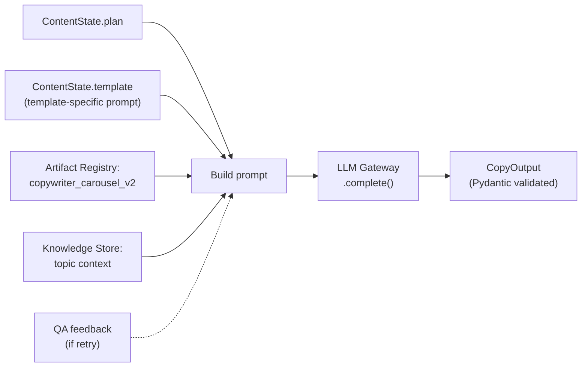

The Generator is now **thin** — it just:
1. Loads the template-specific prompt from the Artifact Registry
2. Injects plan data + topic context + optional retry feedback
3. Calls `LLMGateway.complete()` with `output_model=CopyOutput`
4. Returns the validated model

All retry logic, caching, cost tracking, and provider management is handled by the LLM Gateway.

---

### 5.9 · Critic / QA Pass (Quality)

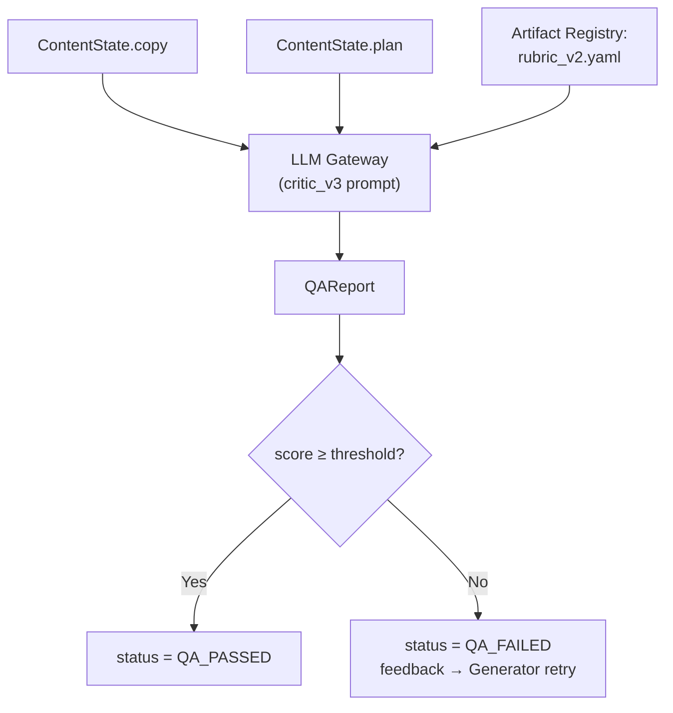

**Versioned rubric** (`rubric_v2.yaml`):
```yaml
version: "v2"
pass_threshold: 7.0
criteria:
  brand_voice:
    weight: 0.20
    description: "Sounds like Gen? Premium, student-first, no jargon"
    score_guide:
      9-10: "Unmistakably Gen. Could not be any other brand."
      7-8: "Clearly on-brand with minor deviations."
      5-6: "Generic but not off-brand."
      1-4: "Off-brand or corporate-sounding."
  hook_strength:
    weight: 0.20
    description: "Pattern interrupt — would someone stop scrolling?"
    score_guide: ...
  value_density:
    weight: 0.20
    description: "Every slide/line delivers value, no filler"
  cta_quality:
    weight: 0.15
    description: "Clear, specific, non-pushy call to action"
  no_cringe:
    weight: 0.15
    description: "No forced humor, no 'fellow kids', no overused phrases"
  hashtag_caption:
    weight: 0.10
    description: "Relevant, not spammy, correct count"
```

---

### 5.10 · RenderSpec Builder (Own Module)

> Extracted from the Orchestrator. Owns the transformation from LLM output → deterministic render input.

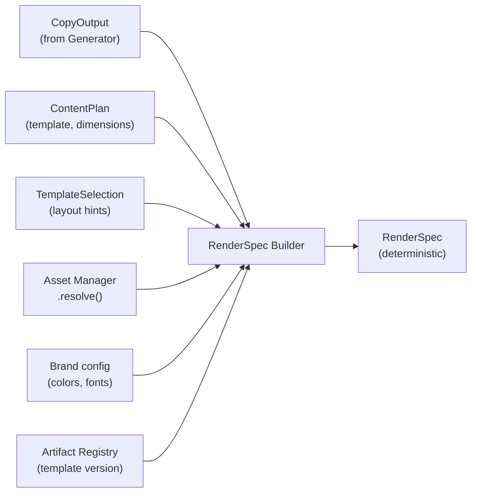

**Why its own module**: This transformation is non-trivial — it maps `visual_note` strings to layout types, resolves icons, applies brand rules, and determines accent colors. Burying it in the Orchestrator hides important logic.

```python
class RenderSpecBuilder:
    def __init__(self, config: Config, asset_manager: AssetManager, registry: ArtifactRegistry):
        self.config = config
        self.assets = asset_manager
        self.registry = registry

    def build(self, state: ContentState) -> RenderSpec:
        resolved_assets = self.assets.resolve(state.plan.assets_needed)
        template_version = self.registry.get_template_version(state.template.template_type)

        return RenderSpec(
            template=state.template.template_type,
            template_version=template_version,
            dimensions=DIMENSIONS[state.plan.dimensions],
            brand_colors=self.config.brand.colors,
            font_family=self.config.brand.font_heading,
            logo_path=self.assets.get_logo(),
            assets=resolved_assets,
            slides=[
                SlideRenderData(
                    slide_num=s.slide_num,
                    heading=s.heading,
                    body=s.body,
                    layout=self._infer_layout(s.visual_note, state.template.layout_hints),
                    accent_color=self._pick_accent(s.slide_num),
                    icon=self._match_icon(s.visual_note, resolved_assets)
                )
                for s in state.copy.slides
            ]
        )
```

---

### 5.11 · Design Renderer (Rendering)

**Purpose**: Takes `RenderSpec` → Jinja2 template → Playwright screenshot → PNG. Purely deterministic.

```python
class DesignRenderer:
    def __init__(self, config: Config, asset_manager: AssetManager, registry: ArtifactRegistry):
        self.registry = registry
        self.asset_manager = asset_manager

    async def render(self, render_spec: RenderSpec) -> list[Path]:
        # Load the versioned template HTML
        template_html = self.registry.get_template_html(
            render_spec.template  # e.g. "carousel_v6.html"
        )
        template = self.jinja_env.from_string(template_html)
        images = []

        async with async_playwright() as p:
            browser = await p.chromium.launch()
            for slide in render_spec.slides:
                html = template.render(
                    slide=slide,
                    brand=render_spec.brand_colors,
                    font=render_spec.font_family,
                    logo=render_spec.logo_path,
                    assets=render_spec.assets
                )
                page = await browser.new_page(viewport=render_spec.dimensions)
                await page.set_content(html)
                path = self.output_dir / f"slide_{slide.slide_num}.png"
                await page.screenshot(path=str(path), type="png")
                images.append(path)
            await browser.close()

        return images
```

---

### 5.12 · Asset Manager (Foundation)

```
assets/
├── manifest.json
├── fonts/
│   ├── PlusJakartaSans-Bold.woff2
│   ├── PlusJakartaSans-Regular.woff2
│   └── Inter-Regular.woff2
├── logos/
│   ├── jobingen_logo_white.svg
│   ├── jobingen_logo_dark.svg
│   └── jobingen_icon.svg
├── icons/
│   ├── email.svg, check.svg, star.svg
│   ├── briefcase.svg, graduation.svg
│   └── ... (30+ icons)
├── backgrounds/
│   ├── gradient_blue.png
│   ├── gradient_dark.png
│   └── pattern_dots.svg
└── illustrations/
    ├── student_laptop.svg
    └── handshake.svg
```

**Interface**:
```python
class AssetManager:
    def resolve(self, asset_ids: list[str]) -> dict[str, str]: ...
    def get_brand_fonts(self) -> dict[str, str]: ...
    def get_logo(self, variant: str = "white") -> str: ...
    def validate(self) -> list[str]:
        """Check all manifest entries point to existing files. Fail fast at startup."""
```

---

### 5.13 · Event Bus (Extensibility)

> Not required for Phase 1 pipeline execution, but built into the Orchestrator from day one so plugins can subscribe without modifying core code.

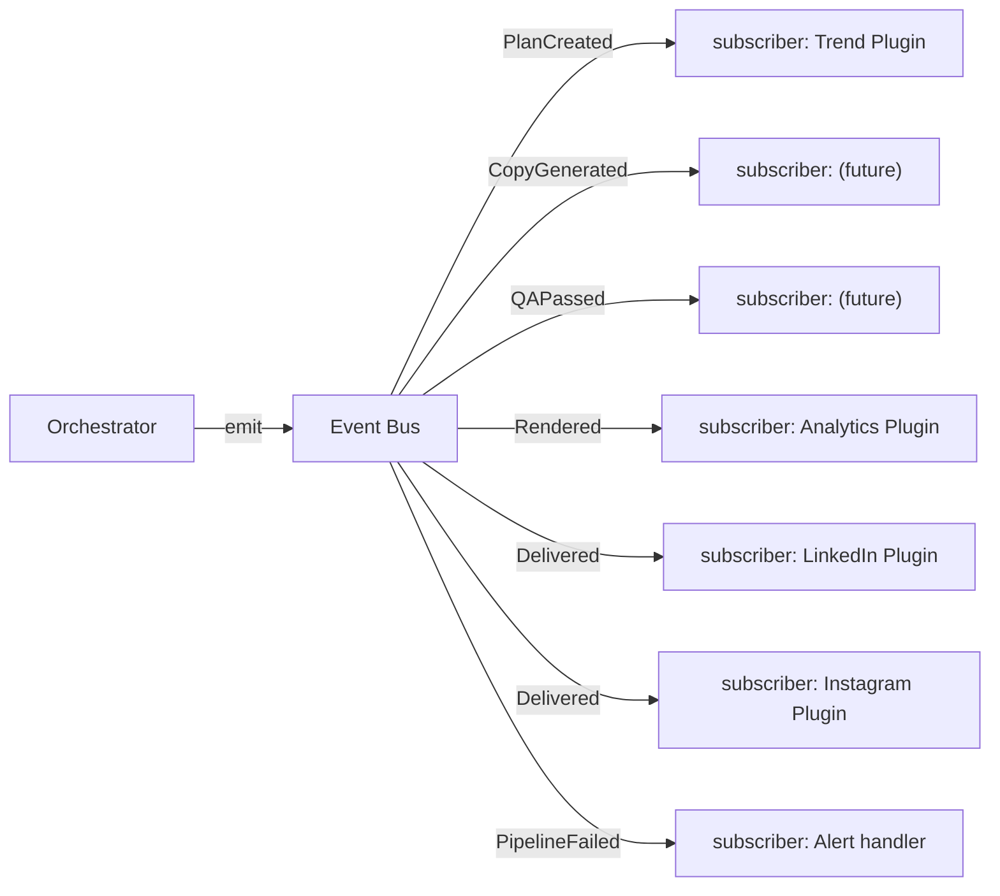

**Events emitted by the pipeline**:

| Event | Payload | When |
|-------|---------|------|
| `PlanCreated` | `ContentState` (after planning) | Planner completes |
| `TemplateSelected` | `ContentState` (with template) | Template Selector completes |
| `CopyGenerated` | `ContentState` (with copy) | Generator completes (before QA) |
| `QAPassed` | `ContentState` (with QA report) | Critic approves |
| `QAFailed` | `ContentState` (with feedback) | Critic rejects |
| `RenderSpecBuilt` | `ContentState` (with render spec) | RenderSpec Builder completes |
| `Rendered` | `ContentState` (with image paths) | Renderer completes |
| `Delivered` | `ContentState` (with manifest) | Queue delivers |
| `PipelineFailed` | `ContentState` (with errors) | Any unrecoverable failure |

**Implementation** (simple, no external deps):
```python
class EventBus:
    def __init__(self):
        self._subscribers: dict[str, list[Callable]] = defaultdict(list)

    def subscribe(self, event: str, handler: Callable):
        self._subscribers[event].append(handler)

    async def emit(self, event: str, state: ContentState):
        for handler in self._subscribers[event]:
            try:
                await handler(state)
            except Exception as e:
                logger.error(f"Event handler failed", event=event, error=str(e))
                # Never let a subscriber crash the pipeline
```

**Phase 2 plugins register themselves**:
```python
# In PluginManager.__init__
if config.plugins.linkedin_publish.enabled:
    plugin = LinkedInPublishPlugin(config)
    self.event_bus.subscribe("Delivered", plugin.on_delivered)

if config.plugins.analytics_loop.enabled:
    plugin = AnalyticsPlugin(config)
    self.event_bus.subscribe("Rendered", plugin.on_rendered)
```

---

### 5.14 · Observability & Metrics (Foundation)

> Beyond logging — emit structured metrics for every run.

**Metrics emitted per run**:

| Metric | Type | Example |
|--------|------|---------|
| `pipeline.duration_ms` | gauge | 47000 |
| `pipeline.status` | label | "delivered" |
| `llm.latency_ms` | histogram | 3200 |
| `llm.tokens_total` | counter | 4521 |
| `llm.cost_usd` | counter | 0.023 |
| `llm.cache_hit_rate` | gauge | 0.33 |
| `qa.score` | gauge | 8.2 |
| `qa.retry_count` | counter | 1 |
| `qa.pass_rate` | gauge | 0.92 (rolling 30-day) |
| `renderer.duration_ms` | gauge | 8500 |
| `renderer.image_count` | counter | 5 |
| `planner.topic_score` | gauge | 0.87 |
| `planner.pillar_deficit` | gauge | 0.12 |
| `prompt.version` | label | "copywriter_carousel_v2" |

**Storage**: Written to `pipeline_metrics` table in Operational Store. Phase 2: export to Prometheus/Grafana.

**Metrics Collector interface**:
```python
class MetricsCollector:
    def __init__(self, ops_store: OperationalStore):
        self.store = ops_store
        self.current_metrics: list[Metric] = []

    def record(self, name: str, value: float, labels: dict = {}):
        self.current_metrics.append(Metric(name=name, value=value, labels=labels))

    def flush(self, run_id: str):
        """Write all collected metrics to the Operational Store."""
        self.store.write_metrics(run_id, self.current_metrics)
        self.current_metrics.clear()

    def get_rolling(self, metric_name: str, days: int = 30) -> float:
        """Get rolling average for dashboards."""
        ...
```

---

### 5.15 · Output Queue (Delivery)

**Output folder structure per day**:
```
output/2026-06-27/
├── pack_manifest.json
├── content_state.json          # Full state snapshot
├── content_plan.json
├── copy.json
├── qa_report.json
├── render_spec.json
├── checkpoints/
│   ├── planned.json
│   ├── template_set.json
│   ├── drafted.json
│   ├── qa_passed.json
│   ├── render_spec_built.json
│   └── rendered.json
├── images/
│   ├── slide_1.png
│   └── ...
└── ready_to_post/
    ├── caption.txt
    └── hashtags.txt
```

**`pack_manifest.json`**:
```json
{
  "run_id": "a1b2c3d4",
  "date": "2026-06-27",
  "status": "pending_review",
  "pillar": "Educate",
  "topic": "Cold email formula",
  "template": "carousel",
  "qa_score": 8.2,
  "qa_attempts": 1,
  "topic_score": 0.87,
  "image_count": 5,
  "images": ["images/slide_1.png", "..."],
  "generation_time_ms": 47000,
  "llm_cost_usd": 0.023,
  "artifact_versions": {
    "planner_prompt": "v4",
    "copywriter_prompt": "copywriter_carousel_v2",
    "critic_prompt": "v3",
    "rubric": "v2",
    "template": "carousel_v6"
  },
  "created_at": "2026-06-27T06:00:12Z"
}
```

---

### 5.16 · Orchestrator (Pipeline Controller)

```python
class Orchestrator:
    def __init__(self, config: Config):
        # Foundation
        self.registry = ArtifactRegistry(config)
        self.assets = AssetManager(config)
        self.gateway = LLMGateway(config)
        self.metrics = MetricsCollector(config)
        self.event_bus = EventBus()

        # Data
        self.knowledge = KnowledgeStore(config)
        self.ops = OperationalStore(config)
        self.memory = Memory(self.ops)

        # Pipeline stages
        self.planner = ContentPlanner(config, self.registry, self.memory, self.knowledge)
        self.template_selector = TemplateSelector(self.registry, config)
        self.generator = CopyGenerator(config, self.registry, self.gateway, self.knowledge)
        self.critic = CriticQA(config, self.registry, self.gateway)
        self.render_spec_builder = RenderSpecBuilder(config, self.assets, self.registry)
        self.renderer = DesignRenderer(config, self.assets, self.registry)
        self.queue = OutputQueue(config)

        # Plugins
        self.plugins = PluginManager(config, self.event_bus)

    async def run(self, date: str, dry_run: bool = False) -> ContentState:
        state = ContentState(date=date)
        start = time.monotonic()

        try:
            # ── Step 1: Plan ──
            state.plan = self.planner.create_plan(state)
            state.status = PipelineStatus.PLANNED
            state.artifact_versions = self.registry.snapshot()
            self._checkpoint(state)
            await self.event_bus.emit("PlanCreated", state)

            # ── Step 2: Select Template ──
            state.template = self.template_selector.select(state.plan)
            state.status = PipelineStatus.TEMPLATE_SET
            self._checkpoint(state)
            await self.event_bus.emit("TemplateSelected", state)

            # ── Step 3–4: Generate + QA Loop ──
            for attempt in range(1, 4):
                state.qa_attempts = attempt
                feedback = state.qa.feedback if state.qa else None

                # Generate copy using template-specific prompt
                state.copy, call_log = await self.generator.generate(
                    state.plan, state.template, feedback
                )
                state.llm_calls.append(call_log)
                state.status = PipelineStatus.DRAFTED
                self._checkpoint(state)
                await self.event_bus.emit("CopyGenerated", state)

                # Critic QA
                state.qa, call_log = await self.critic.evaluate(
                    state.copy, state.plan
                )
                state.llm_calls.append(call_log)

                if state.qa.passed:
                    state.status = PipelineStatus.QA_PASSED
                    await self.event_bus.emit("QAPassed", state)
                    break
                else:
                    state.status = PipelineStatus.QA_FAILED
                    await self.event_bus.emit("QAFailed", state)

            # ── Step 5: Build RenderSpec ──
            state.render_spec = self.render_spec_builder.build(state)
            state.status = PipelineStatus.RENDER_SPEC
            self._checkpoint(state)
            await self.event_bus.emit("RenderSpecBuilt", state)

            if not dry_run:
                # ── Step 6: Render ──
                state.image_paths = await self.renderer.render(state.render_spec)
                state.status = PipelineStatus.RENDERED
                self._checkpoint(state)
                await self.event_bus.emit("Rendered", state)

                # ── Step 7: Package & Deliver ──
                state = self.queue.package(state)
                state.status = PipelineStatus.DELIVERED
                await self.event_bus.emit("Delivered", state)

            # ── Record ──
            state.total_duration_ms = int((time.monotonic() - start) * 1000)
            self.memory.log_run(state)
            self._record_metrics(state)

        except Exception as e:
            state.status = PipelineStatus.FAILED
            state.errors.append(str(e))
            await self.event_bus.emit("PipelineFailed", state)

        return state
```

---

## 6. Complete Data Flow

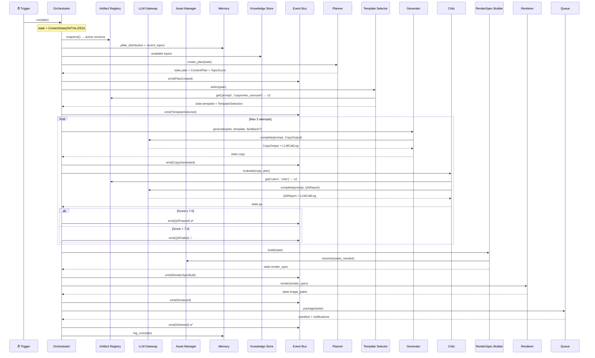

---

## 7. Phase 2 — Plugin Architecture

### Plugin Registration via Event Bus

```python
class BasePlugin(ABC):
    @abstractmethod
    def name(self) -> str: ...

    @abstractmethod
    def subscriptions(self) -> dict[str, Callable]:
        """Return {event_name: handler} for Event Bus registration."""
        ...

# Example: LinkedIn plugin
class LinkedInPublishPlugin(BasePlugin):
    def name(self): return "linkedin_publish"
    def subscriptions(self):
        return {"Delivered": self.on_delivered}
    async def on_delivered(self, state: ContentState):
        if state.status == PipelineStatus.DELIVERED:
            await self._post_to_linkedin(state)
```

### P2.5 · Analytics → Learning Module → Planner

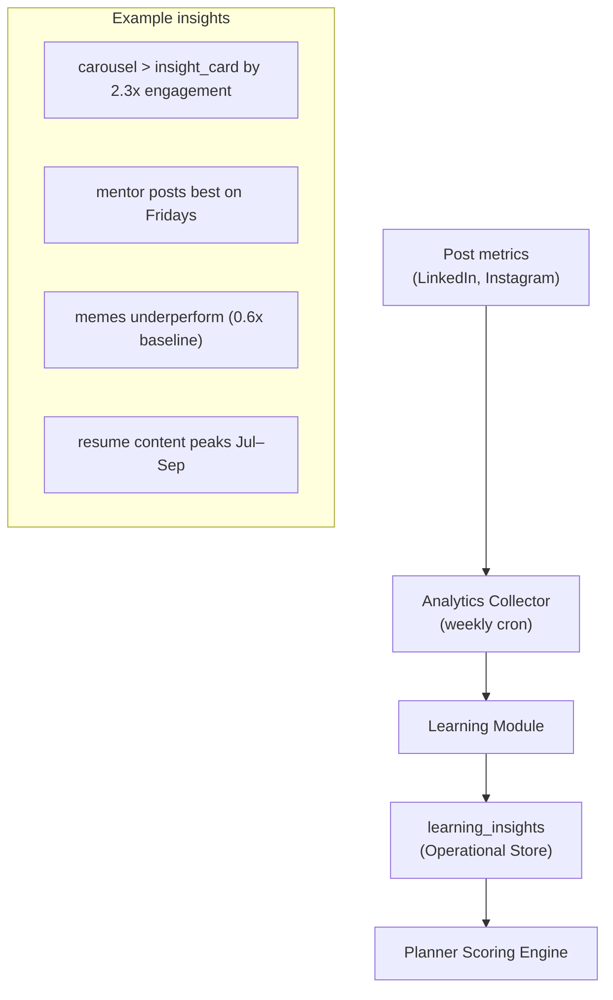

The Learning Module writes to `learning_insights`. The Planner reads these insights and incorporates them into the `engagement_history` and `seasonality` scoring factors.

---

## 8. Final Directory Structure

```
jobingen-engine/
├── config.yaml
├── main.py                              # CLI entry point
├── requirements.txt
├── Dockerfile
├── .env.example
│
├── registry/                            # Artifact Registry (version everything)
│   ├── prompts/
│   │   ├── planner_v1..v4.yaml
│   │   ├── copywriter_carousel_v1..v2.yaml
│   │   ├── copywriter_jobdrop_v1.yaml
│   │   ├── copywriter_meme_v1.yaml
│   │   ├── copywriter_comparison_v1.yaml
│   │   ├── copywriter_success_v1.yaml
│   │   ├── copywriter_mentor_v1.yaml
│   │   ├── copywriter_insight_v1.yaml
│   │   └── critic_v1..v3.yaml
│   ├── rubrics/
│   │   └── rubric_v1..v2.yaml
│   ├── schemas/
│   │   ├── copy_output_v1..v2.json
│   │   └── render_spec_v1.json
│   └── templates/
│       ├── base.css
│       ├── carousel_v1..v6.html
│       ├── insight_card_v1..v3.html
│       ├── job_drop_v1..v3.html
│       ├── comparison_v1..v2.html
│       ├── success_story_v1.html
│       ├── mentor_spotlight_v1.html
│       └── meme_v1..v2.html
│
├── assets/                              # Asset Manager
│   ├── manifest.json
│   ├── fonts/
│   ├── logos/
│   ├── icons/
│   ├── backgrounds/
│   └── illustrations/
│
├── src/
│   ├── __init__.py
│   ├── orchestrator.py
│   ├── models/
│   │   ├── __init__.py
│   │   └── content_state.py             # All Pydantic models
│   ├── foundation/
│   │   ├── __init__.py
│   │   ├── artifact_registry.py
│   │   ├── asset_manager.py
│   │   ├── llm_gateway.py
│   │   ├── event_bus.py
│   │   └── metrics_collector.py
│   ├── data/
│   │   ├── __init__.py
│   │   ├── knowledge_store.py
│   │   ├── operational_store.py
│   │   ├── memory.py
│   │   └── seed_data/
│   │       ├── topics_bank.json
│   │       ├── jobs_sheet.json
│   │       ├── testimonials.json
│   │       └── calendar_config.json
│   ├── intelligence/
│   │   ├── __init__.py
│   │   ├── planner.py                   # Scoring engine
│   │   └── template_selector.py
│   ├── llm/
│   │   ├── __init__.py
│   │   ├── copy_generator.py
│   │   └── qa_pass.py
│   ├── rendering/
│   │   ├── __init__.py
│   │   ├── render_spec_builder.py
│   │   └── renderer.py
│   ├── delivery/
│   │   ├── __init__.py
│   │   └── output_queue.py
│   ├── plugins/
│   │   ├── __init__.py
│   │   ├── base_plugin.py
│   │   ├── plugin_manager.py
│   │   ├── linkedin_publish.py
│   │   ├── instagram_publish.py
│   │   ├── job_ingestion.py
│   │   ├── trend_ingestion.py
│   │   └── analytics_loop.py
│   └── utils/
│       ├── __init__.py
│       ├── logger.py
│       └── config_loader.py
│
├── output/
│   └── 2026-06-27/
│       ├── pack_manifest.json
│       ├── content_state.json
│       ├── checkpoints/
│       ├── images/
│       └── ready_to_post/
│
├── data/
│   ├── knowledge.db                     # Knowledge Store
│   └── operational.db                   # Operational Store
│
├── logs/
│
└── tests/
    ├── test_planner.py
    ├── test_template_selector.py
    ├── test_generator.py
    ├── test_critic.py
    ├── test_render_spec_builder.py
    ├── test_renderer.py
    ├── test_memory.py
    ├── test_llm_gateway.py
    ├── test_event_bus.py
    ├── test_orchestrator.py
    └── fixtures/
```

---

## 9. Error Handling

| Failure Point | Handling | Alert |
|--------------|----------|-------|
| LLM API timeout | LLM Gateway: 3 retries, exponential backoff → fallback model | Log warning |
| LLM invalid JSON | LLM Gateway: re-request with error context | Log warning |
| Pydantic validation fail | LLM Gateway: auto-retry with schema hint | Log warning |
| Critic fails 3× | Force-pass with `⚠️` flag in manifest | Event: PipelineFailed |
| Playwright crash | Retry once → fail run | Event: PipelineFailed |
| SQLite error | Fail run, never corrupt data | Event: PipelineFailed |
| Missing asset | AssetManager.validate() at startup | Fail fast |
| Missing config field | Pydantic config validation at startup | stderr + exit |
| Plugin handler crashes | Event Bus catches + logs. Never crashes pipeline | Log error |

---

## 10. Deployment & CI/CD

### Local
```bash
python -m venv venv && source venv/bin/activate
pip install -r requirements.txt
playwright install chromium
cp .env.example .env
python main.py --dry-run
python main.py
```

### Docker
```dockerfile
FROM python:3.11-slim
RUN apt-get update && apt-get install -y libglib2.0-0 libnss3 libatk-bridge2.0-0
WORKDIR /app
COPY requirements.txt .
RUN pip install -r requirements.txt && playwright install chromium --with-deps
COPY . .
CMD ["python", "main.py"]
```

### GitHub Actions (Recommended)
```yaml
name: Daily Content Generation
on:
  schedule: [{ cron: '30 0 * * *' }]    # 6:00 AM IST
  workflow_dispatch:
jobs:
  generate:
    runs-on: ubuntu-latest
    steps:
      - uses: actions/checkout@v4
      - uses: actions/setup-python@v5
        with: { python-version: '3.11' }
      - run: pip install -r requirements.txt
      - run: playwright install chromium --with-deps
      - run: python main.py
        env:
          ANTHROPIC_API_KEY: ${{ secrets.ANTHROPIC_API_KEY }}
      - uses: actions/upload-artifact@v4
        with:
          name: content-pack-${{ github.run_id }}
          path: output/
```

### CLI Commands
```bash
python main.py                         # Generate for today
python main.py --date 2026-06-27       # Specific date
python main.py --dry-run               # Skip rendering & notifications
python main.py --pillar Educate        # Force a pillar
python main.py --rerender --date ...   # Re-render from saved state
python main.py --seed                  # Seed the Knowledge Store
python main.py --prompts list          # List artifact versions
python main.py --metrics               # Show rolling metrics
```

---

## 11. Build Order

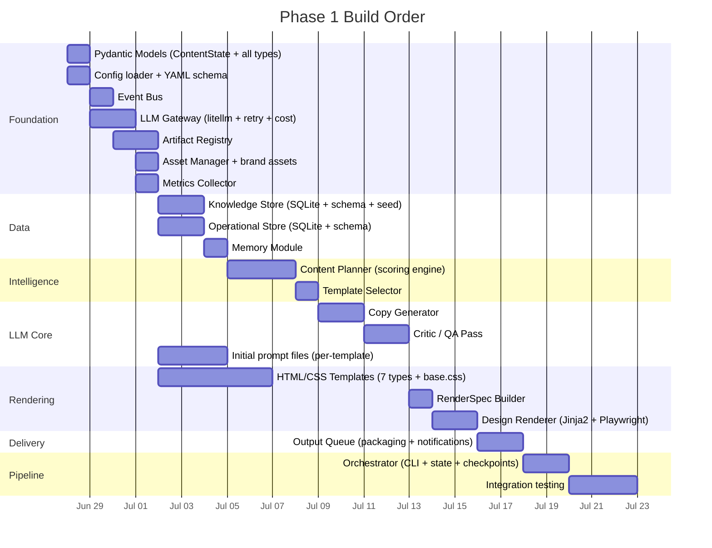

**Estimated Phase 1**: ~4 weeks for a solo developer.

---

## 12. Dependencies

```
# requirements.txt
litellm>=1.40.0              # Unified LLM interface
pydantic>=2.0                # Typed models & validation
jinja2>=3.1                  # HTML template rendering
playwright>=1.40             # Headless browser screenshots
pyyaml>=6.0                  # Config parsing
python-dotenv>=1.0           # .env loading
rich>=13.0                   # CLI output & logging
click>=8.1                   # CLI arguments
aiosqlite>=0.19              # Async SQLite
httpx>=0.27                  # HTTP client (webhooks)
structlog>=24.0              # Structured JSON logging
cachetools>=5.3              # LLM response caching
```

---

## Open Questions

> [!IMPORTANT]
> **LLM Provider**: Claude (Anthropic) or GPT (OpenAI) as the default? `litellm` supports both — config only.

> [!IMPORTANT]
> **Notification Channel**: Preferred Phase 1 delivery channel? Local folder / Slack / WhatsApp / Notion?

> [!NOTE]
> **Topic Bank Size**: Recommend 30–50 topics per pillar (150–250 total) for ~6 months.

> [!NOTE]
> **Hosting**: Local machine, VPS, or GitHub Actions?
