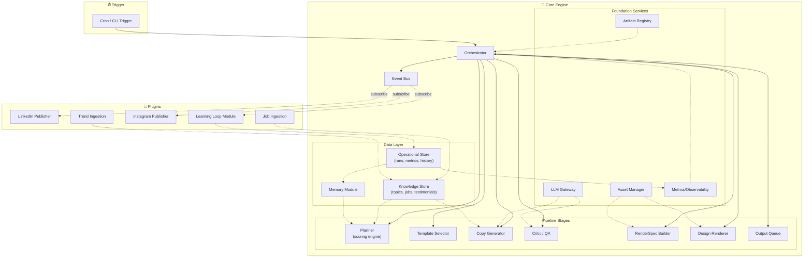

# JobInGen AI Content Creation Engine — System Architecture v3 (Final)

A production-ready, fully automated AI content engine that designs and outputs social media posts (optimized copy + designed HTML/CSS-to-PNG carousel images) for JobInGen. One command triggers the complete content creation and delivery pipeline.

> [!IMPORTANT]
> **Live Architecture Notice**: All offline mock fallbacks, developer dry-runs, and bypass safety guards have been completely removed. The engine runs 100% live. It will hit actual APIs (LiteLLM, Playwright, Meta, LinkedIn, Discord Webhooks) and raise native exceptions transparently if credentials or configurations are invalid.

---

## 1. Architectural Principles

| # | Principle | How |
|---|-----------|-----|
| 1 | **Typed Contracts** | All data exchanges between modules use Pydantic models ([content_state.py](file:///c:/Users/risha/OneDrive/Desktop/AI%20AUTOMATION%20JOBINGEN/src/models/content_state.py)). No loose dictionaries or free-form strings. |
| 2 | **Single State Context** | A single `ContentState` object flows through the entire pipeline. Every stage reads from and logs to it. |
| 3 | **Centralized Orchestration** | The [Orchestrator](file:///c:/Users/risha/OneDrive/Desktop/AI%20AUTOMATION%20JOBINGEN/src/pipeline/orchestrator.py) controls the dependency flow. Code stages never invoke each other. |
| 4 | **Deterministic Rendering** | Page layout outputs a `RenderSpec` specifying exact CSS variables, logos, and layouts—never loose LLM text. |
| 5 | **Versioned Registry** | Prompts, templates, schemas, and scoring rubrics are managed as versioned code inside the `registry/` directory. |
| 6 | **Separated Data Stores** | Knowledge assets (testimonials, jobs, calendar) live in the `KnowledgeStore`, while operational history and metrics live in the `OperationalStore`. |
| 7 | **Provider-Agnostic LLM** | The `LLMGateway` handles caching, retry, fallback logic, cost tracking, and automatic schema-healing (`RepairProvider`) without exposing providers. |
| 8 | **Event-Driven Extensibility** | An internal `EventBus` manages system integrations. Event subscribers (plugins) hook into pipeline milestones without code changes in the orchestrator. |

---

## 2. Directory Structure

```text
├── assets/                  # Brand assets (logos, fonts, icons, manifest)
├── data/                    # SQLite databases (knowledge, operational) and CSV inputs
├── registry/                # The version-controlled prompt, template, and rubric registry
│   ├── prompts/             # LLM prompt templates (planner, copywriter, critic)
│   ├── rubrics/             # Quality evaluation rubrics (critic_v2.yaml)
│   ├── schemas/             # Pydantic validation schemas
│   └── templates/           # CSS/HTML slide design templates (Jinja2)
├── src/
│   ├── foundation/          # Core infrastructure (LLM gateway, registry, assets, bus, metrics)
│   ├── data/                # Data storage engines, memory, and SQLite migrations
│   ├── intelligence/        # Scoring engines, planners, and template selectors
│   ├── llm/                 # Copywriter generator and quality control QA
│   ├── rendering/           # Render spec builder and Playwright design rendering engine
│   ├── delivery/            # Output queues, packaging, and SQLite logging
│   └── plugins/             # Event bus plugins (publishers, ingestion, analytics, learning loop)
├── test_*.py                # Comprehensive modular unit tests
├── requirements.txt         # Project dependencies
├── run_engine.py            # Primary E2E entry point CLI
└── testing_guide.md         # Detailed testing commands and expected errors
```

---

## 3. High-Level Architecture Flow



---

## 4. Setup & Configuration

### Prerequisites
* Python 3.11+
* Chrome/Chromium (managed by Playwright)

### Installation
1. Install project dependencies:
   ```powershell
   pip install -r requirements.txt
   ```
2. Initialize Playwright:
   ```powershell
   playwright install chromium
   ```

### Environment Variables
Copy `.env.example` to `.env` and configure your API keys:
```text
GEMINI_API_KEY=your-gemini-key          # Core LLM text generation and image creation
DISCORD_WEBHOOK_URL=your-webhook        # Human-in-the-loop review alerts
IG_ACCESS_TOKEN=your-meta-token         # (Optional) Instagram publisher
IG_USER_ID=your-ig-id                   # (Optional) Instagram publisher
LINKEDIN_ACCESS_TOKEN=your-token        # (Optional) LinkedIn publisher
LINKEDIN_AUTHOR_URN=your-urn            # (Optional) LinkedIn publisher
```

### Plugin Toggles
Open [config.yaml](file:///c:/Users/risha/OneDrive/Desktop/AI AUTOMATION JOBINGEN/config.yaml) to enable or disable specific plugins. When plugins are set to `enabled: false`, they are skipped during Event Bus setup and will not trigger:
```yaml
plugins:
  analytics_loop:
    enabled: true
  instagram_publish:
    enabled: false
  job_ingestion:
    enabled: true
  linkedin_publish:
    enabled: false
  trend_ingestion:
    enabled: true
```

---

## 5. Execution Commands

For a step-by-step walkthrough, refer to the [Testing Guide](file:///c:/Users/risha/OneDrive/Desktop/AI%20AUTOMATION%20JOBINGEN/testing_guide.md).

### 1. Run the End-to-End Pipeline
Executes ingestion, planning, copywriting, QA scoring, and final PNG generation:
```powershell
python run_engine.py
```

### 2. Verify Event Bus Publishing & Webhooks
Fires a mock packaging complete signal and triggers enabled social network publishers:
```powershell
$env:PYTHONIOENCODING="utf-8"; python test_publishing.py
```

### 3. Run the Unit Test Suite
```powershell
$env:PYTHONIOENCODING="utf-8"; python test_config.py; python test_llm_gateway.py; python test_planner.py; python test_template_selector.py; python test_copy_generator.py; python test_memory.py; python test_metrics_collector.py; python test_operational_store.py; python test_knowledge_store.py; python test_event_bus.py
```
